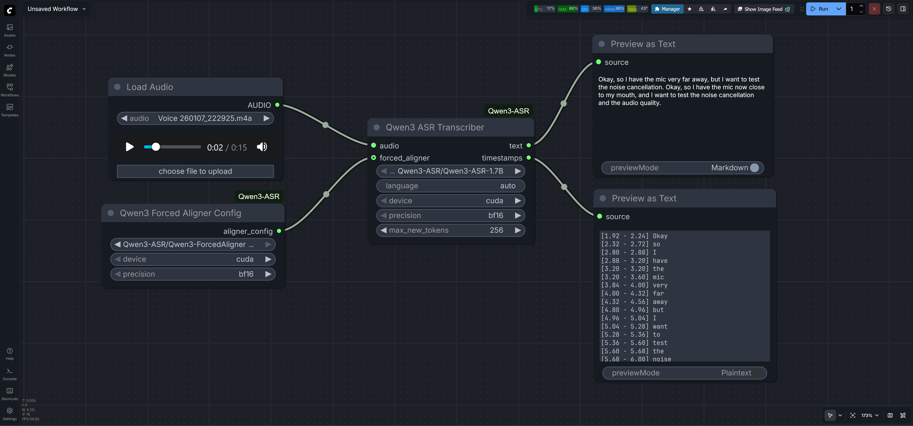

# ComfyUI Qwen3 ASR

This extension integrates the **Qwen3-ASR** model family into ComfyUI, providing high-quality speech-to-text transcription and precise word-level timestamps using the Qwen3 Forced Aligner.

## Features
- **High Accuracy**: Supports Qwen3-ASR 0.6B and 1.7B models.
- **Multilingual**: Supports 52 languages and dialects with automatic language detection.
- **Word-Level Timestamps**: Optional integration with Qwen3-ForcedAligner-0.6B.
- **Flexible Precision**: Support for `bf16`, `fp16`, and `fp32` to balance VRAM and speed.
- **Automatic Resampling**: Internally handles audio resampling to 16kHz for optimal model performance.


## Preview



## Installation

1. Navigate to your ComfyUI `custom_nodes` directory:
   ```bash
   cd ComfyUI/custom_nodes
   ```
2. Clone this repository:
   ```bash
   git clone https://github.com/kaushiknishchay/ComfyUI-Qwen3-ASR
   ```
3. Install the dependencies using your ComfyUI Python executable:
   ```bash
   # For portable versions, use the full path to your python.exe
   python.exe -m pip install -r ComfyUI-Qwen3-ASR/requirements.txt
   ```

## Model Setup

Models must be placed in the `models/diffusion_models/Qwen3-ASR/` directory. Each model should be in its own subfolder containing the full weights and configuration.

### Recommended Directory Structure:
```
ComfyUI/models/diffusion_models/Qwen3-ASR/
├── Qwen3-ASR-1.7B/
│   ├── config.json
│   ├── model.safetensors
│   └── ...
├── Qwen3-ASR-0.6B/
│   └── ...
└── Qwen3-ForcedAligner-0.6B/
    └── ...
```

### Downloading Models
You can use the `huggingface-cli` to download the models directly into the correct folders:
```bash
huggingface-cli download Qwen/Qwen3-ASR-1.7B --local-dir models/diffusion_models/Qwen3-ASR/Qwen3-ASR-1.7B
huggingface-cli download Qwen/Qwen3-ForcedAligner-0.6B --local-dir models/diffusion_models/Qwen3-ASR/Qwen3-ForcedAligner-0.6B
```

## Node Usage

### 1. Qwen3 ASR Transcriber
The main node for generating transcriptions.

**Inputs:**
- `audio`: The audio input from a "Load Audio" node.
- `model_name`: Select the ASR model folder from the dropdown.
- `language`: Set to `auto` for automatic detection, or specify a language (e.g., `English`, `Chinese`).
- `device`: `cuda` (recommended) or `cpu`.
- `precision`: `bf16` (recommended for RTX 30/40 series), `fp16`, or `fp32`.
- `max_new_tokens`: Maximum length of the generated text.
- `forced_aligner` (Optional): Connect the output of a **Qwen3 Forced Aligner Config** node here to enable timestamps.

**Outputs:**
- `text`: The raw transcription text.
- `timestamps`: A formatted string containing word-level timestamps (requires the Forced Aligner).

### 2. Qwen3 Forced Aligner Config
A configuration node that prepares the alignment model.

**Inputs:**
- `model_name`: Select the `Qwen3-ForcedAligner-0.6B` folder.
- `device`: Should match the Transcriber node.
- `precision`: Should match the Transcriber node.

**Outputs:**
- `aligner_config`: Connect this to the `forced_aligner` input on the Transcriber node.

## Troubleshooting

- **Python 3.13 Issues**: If you encounter an `UnboundLocalError` related to `lazy_loader`, ensure you have updated the package:
  ```bash
  python.exe -m pip install -U lazy-loader
  ```
- **VRAM Usage**: The 1.7B model requires approximately 4-6GB of VRAM in `bf16` mode. If you run out of memory, try the 0.6B model or use `cpu` mode.

## License
This project is licensed under the MIT License. The Qwen3 models are subject to the Qwen License Agreement.